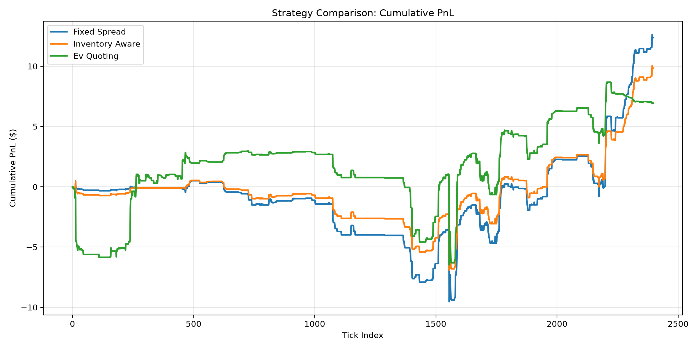
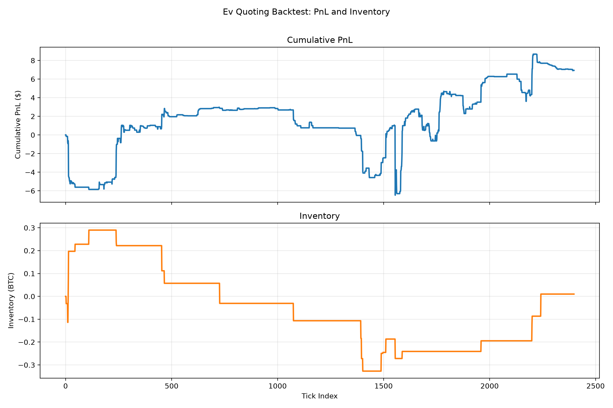

# Swiftplay

[](https://github.com/TaelanSakay/Swiftplay/actions/workflows/test.yml)

Swiftplay is a solo-built cryptocurrency market-making system for Binance.US BTCUSD. It is a portfolio project focused on **decision-quality quoting**: every quote is produced by an inspectable decision engine with an explicit reasoning trace, rather than treating raw execution speed as the primary objective.

The architecture is intentionally distinct from a separate HFT-style project I co-built with a friend. That project centers on a C++ matching engine; Swiftplay centers on explainable expected-value decisions, realistic replay, and performance work grounded in profiling.

## Architecture

The system separates market-data and execution concerns from decision logic:

```text
data_feed -> lob -> features -> decision -> risk -> backtest metrics
```

- `lob/` contains the Python limit order book simulator, partial fills, cancellations, price-time priority on crosses, and an optional pybind11 acceleration path.
- `data_feed/` contains live-feed boundaries and `HistoricalReplayFeed` for recorded Binance.US depth data.
- `features/` computes order-book imbalance, microprice, OFI, realized volatility, and spread.
- `decision/` contains the `QuoteDecisionEngine` interface and Fixed Spread, Inventory Aware, and EV Quoting strategies.
- `models/` contains fill-probability training, artifacts, and the estimator used by EV Quoting.
- `risk/` applies reusable inventory limits, equity drawdown protection, and volatility-based spread widening.
- `backtest/` runs the feed -> book -> features -> strategy -> risk -> fills event loop and calculates performance metrics.

The core boundary is `QuoteDecisionEngine.generate_quote(...)`, which returns a `Quote` with a `QuoteReasoning` record. The reasoning fields are `expected_value`, `fill_probability_bid`, `fill_probability_ask`, `inventory_penalty`, `adverse_selection_penalty`, `confidence`, and `explanation`. This keeps strategy business logic independently testable and makes each decision observable.

## Performance Engineering

Profiling the LOB showed that repeated O(n) scans for `best_bid` and `best_ask` were the dominant cost. The fix was algorithmic: incremental caching with sorted price lists and top-N access in the Python fallback path. The repository's recorded before/after measurements were:

| Version | Throughput | Median latency | P99 latency |
| --- | ---: | ---: | ---: |
| Before algorithmic optimization | ~718 updates/sec | ~1007 us | ~2692 us |
| After incremental caching | ~2136 updates/sec | ~151 us | ~761 us |

The current local benchmark, run against the bundled 2,399-update sample, reports 14,900.53 updates/sec, 33.20 us median latency, and 188.95 us p99 latency. This is an environment-dependent measurement and should not be compared directly with the earlier recorded run without controlling the build and machine configuration.

There is also an optional C++ extension implemented with pybind11. It was built and verified working, but benchmarking showed no meaningful improvement over the already-optimized Python path. After the O(n) issue was removed, the remaining cost was primarily Python object overhead rather than the raw price-level computation. Keeping the extension available while not claiming a speedup is an evidence-based engineering conclusion.

## Data Pipeline

The bundled replay is real Binance.US BTCUSD depth data, not synthetic data. During development, a recorder bug caused approximately 97% of replayed ticks to contain a corrupted, crossed book. The recorder was not following Binance's documented REST snapshot and WebSocket synchronization procedure using `U`, `u`, and `pu` sequence IDs.

The issue was root-caused and fixed by buffering events, finding the event that bridges the REST snapshot, validating sequence continuity, and recording discontinuities. The current sample was recorded with the corrected synchronization logic.

## Fill Probability Model

The fill model uses a time-based 80/20 train/test split and reports both discrimination and calibration. Logistic Regression was selected over Gradient Boosting. Gradient Boosting overfit the small positive class, which contains roughly 30-40 fill events in a 60-minute session.

Later, side-aware signed features were added while retaining raw OFI and imbalance:

- bid side: `ofi_signed = ofi`, `imbalance_signed = imbalance`
- ask side: `ofi_signed = -ofi`, `imbalance_signed = -imbalance`

The selected model's AUC moved only marginally, from `0.686` to `0.689`, so this is not strong statistical evidence at this data scale. The signed feature design is more theoretically correct, but the sample is too small to support a broad performance claim.

## Risk Controls

Risk is applied centrally after a strategy generates a quote and before it reaches the simulator:

- Inventory hard limits cap buy and sell quantities independently, allowing only the risk-reducing side at an inventory boundary.
- The drawdown circuit breaker tracks current equity and peak equity against an explicit starting-equity baseline. It does not calculate a fraction of raw PnL, avoiding an undefined-at-zero baseline bug.
- Volatility-adjusted spread widening moves quotes symmetrically around the market midpoint when realized volatility exceeds its configured baseline.

The default drawdown threshold is `0.02%` of starting equity. That value was calibrated against this project's short reference session and is not a general-purpose default; other datasets and time horizons require their own calibration.

## Adverse Selection Modeling

EV Quoting applies an OFI-based adverse-selection penalty to the side most likely to be picked off by directional flow. Positive OFI penalizes bids, while negative OFI penalizes asks. The penalty is linear in the relevant signed OFI component and is visible in `QuoteReasoning`.

The sign and magnitude were verified by manually inspecting the first 20 real-data quote decisions. The adjustment did not produce a visible change in aggregate backtest metrics for this short session. It is implemented and decision-level verified, but not aggregate-performance-validated at this data scale.

## Backtest Results

The following results come from the current clean, synchronized sample using the real `BacktestRunner` path:

| Strategy | Total PnL | Sharpe | Max DD | Win Rate | Fill Rate | Avg Inv | Max Abs Inv | Breaker | Invalid Quotes |
| --- | ---: | ---: | ---: | ---: | ---: | ---: | ---: | --- | ---: |
| Fixed Spread | $12.38 | 141.68 | $10.03 | 90.8% | 0.02% | -0.11 | 0.22 | inactive | 0 |
| Inventory Aware | $9.84 | 146.66 | $7.43 | 90.3% | 0.01% | -0.08 | 0.18 | inactive | 0 |
| EV Quoting | $6.93 | 65.17 | $9.45 | 88.3% | 0.04% | -0.05 | 0.33 | inactive | 0 |





EV Quoting's lower cumulative PnL reflects its crossed-market safety guard reducing quoting opportunities, not underperformance in a like-for-like comparison. It is a deliberate PnL-for-robustness tradeoff, and the short session is illustrative rather than statistically robust.

## Known Limitations

- **L2 queue approximation:** Binance's public depth stream exposes aggregate L2 quantities, not L3 order-level data. The simulator treats depth decreases at a tracked price as volume ahead of the order, so it cannot distinguish fills from cancellations or know whether a change occurred ahead of or behind the order.
- **Small sample:** The reference data covers roughly 60 minutes. Results are illustrative and not statistically robust.
- **Calibrated threshold:** The `0.02%` drawdown threshold is tuned to this project's reference session and should be recalibrated for other capital bases and horizons.
- **Model evidence:** The signed OFI/imbalance features are directionally designed, but the AUC change from `0.686` to `0.689` is marginal on this small dataset.
- **Native extension:** The C++ extension is functional, but it is not currently performance-critical after the algorithmic Python bottleneck was fixed.

## Setup and Usage

### Python installation

Python 3.11 is required. On Windows PowerShell:

```powershell
.\venv\Scripts\Activate.ps1
python -m pip install -e ".[dev]"
```

Run the tests and quality checks:

```powershell
pytest
flake8 src tests
mypy src tests
```

Run the three-strategy backtest comparison:

```powershell
python -m swiftplay.cli backtest --data data/sample_btcusd_depth.jsonl
```

Generate the README plots:

```powershell
python scripts/plot_backtest.py --strategy ev_quoting --data data/sample_btcusd_depth.jsonl
```

### Optional C++ extension

The pybind11 extension is optional. The Python fallback works without it and is the path used by CI on Ubuntu. On Windows, building the extension requires Visual Studio MSVC Build Tools with C++ support:

```powershell
.\venv\Scripts\Activate.ps1
python -m pip install pybind11
python setup.py build_ext --inplace
```

The extension is not built in GitHub Actions because the workflow runs on `ubuntu-latest` and the project's supported native build path requires Windows MSVC tooling.
